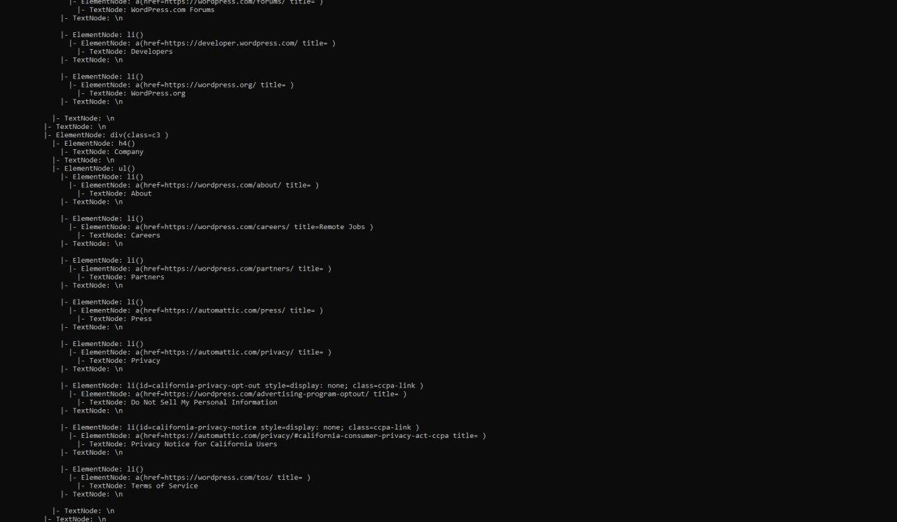
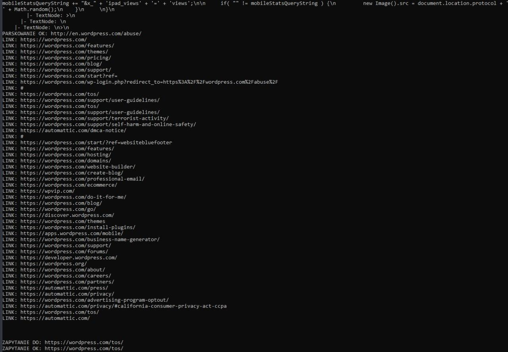

# Crawler stron internetowych

Projekt na zaliczenie "Wstęp do programowania" .

Program wymaga najnowszej wersji C# (Visual Studio 2022). Program służy do pobierania linków z stron internetowych w sposób rekursywny.
Program składa się głównie z prostego parsera HTML oraz głównej klasy, która zajmuje się podążaniem za linkami.

Program zaczyna pracę od strony https://wikipedia.org/ . Ze względu na brak zaawansowania parsera HTML, program jest dosyć powolny.
Dla każdej strony wypisywane jest zparsowane drzewo HTML oraz wszystkie linki znajdujące się na stronie.

Screenshoty:

